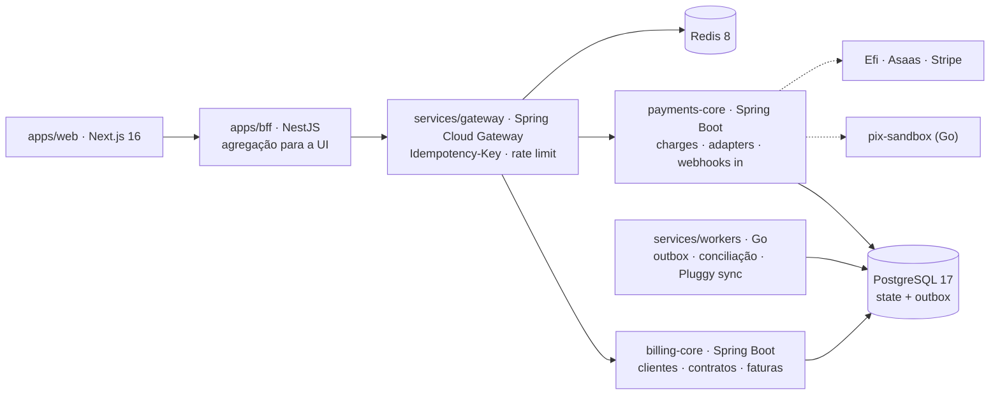

# Arinelli Pay — Design

## Fluxo de produto
CPF/CNPJ (validação de dígitos + dedupe) → **Cliente** → **Contrato** (visão card ⇄ tabela) → **Faturas** → **Cobrança** por trilho (Pix | boleto/QR | cartão) → **Webhook** do provider → worker Go processa o outbox → **Fatura PAID** (UI por polling curto).

## Arquitetura

**Versões (ago/2026, verificadas):** Java 25 LTS · Spring Boot 4.1.x (Framework 7 — a linha 3.x atingiu EOL em 30/jun/2026) · NestJS 11.1.x (v12 em preview, Q3/2026) · Next.js 16.2.11 LTS (React 19.2) · Go 1.26.5 · PostgreSQL 17 · Redis 8.

**Divisão de responsabilidade:** Java/Spring onde há domínio rico e transação; Go onde é concorrente e I/O-bound; Nest como BFF fino (nunca regra de negócio); Next no front. A fronteira entre Java e Go é a **tabela de outbox** — o core decide e grava, o worker entrega.

## Ports & Adapters (I4)
- `PixProvider`: `FakePixProvider` (testes) · `PixSandboxAdapter` (dev) · `EfiAdapter` (sandbox real) · `BbAdapter` (fase 2)
- `BoletoProvider`: `AsaasAdapter` · `CardProvider`: `StripeAdapter` (test mode) · `BankDataProvider`: `PluggyAdapter`

## Estados
- **Invoice:** `DRAFT → OPEN → PAID | OVERDUE | CANCELED`
- **Charge:** `CREATED → PENDING → SETTLED | FAILED(code) → REFUNDED`
- Regra (I7): `PAID` só por consumo de `charge.settled` do outbox.

## Decisões (ADR seeds)
1. **Java/Spring no core, Go nos workers, Nest no BFF** — cada runtime por mérito específico; sem quarto runtime para gateway.
2. **Flyway / SQL-first**, JPA em `validate` — schema é contrato versionado.
3. **BFF fino:** Nest agrega e adapta para a tela; regra de negócio nunca sai do core Java.
4. **Polling curto na UI (v1);** webhook é ingest de PSP, não transporte de UI.
5. **Conciliação webhook × extrato Pluggy** — capítulo de senioridade do projeto.
